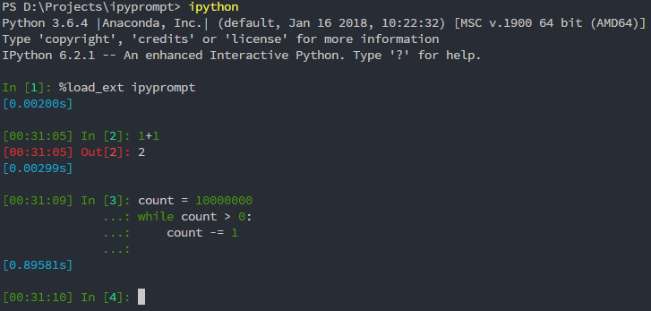

## Usage:

```
pip install ipyprompt
```

Then in a new ipython shell, simply run:

```
%load_ext ipyprompt
```

## Screenshot


- Green / Red prompt before In / Out Cell: **current time**
- Blue prompt after output: **execution time**
